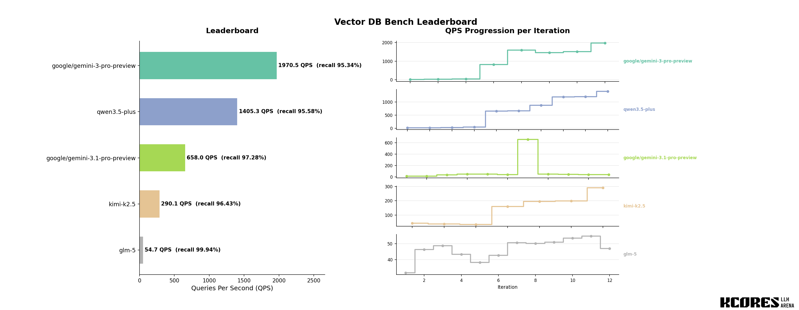

# Vector DB Bench


大模型后端代码能力评测系统。让 LLM 从零实现向量数据库，以搜索 QPS 量化后端工程能力。

## 工作原理

1. 提供 Rust 骨架代码（HTTP API + 空实现桩）
2. LLM 通过 Tool Call Agent 读写文件、编译、测试、profiling
3. 50 次 tool call 内完成实现和优化
4. 最终以 SIFT1M 数据集 benchmark，recall ≥ 95% 的前提下按 QPS 排名

## 排行榜



## 快速开始

```bash
MODEL_NAME={model_name} \
CPU_CORES=0-3 \
THINKING_MODE=openai \
API_INTERVAL_MS=10000 \
WORK_DIR=./leaderboard/{model_name} \
API_URL={api_address} \
API_KEY={your_api_key} \
MODEL_ID={model_name} \
bash scripts/run_eval.sh 
```

详细使用说明见 [USAGE.md](USAGE.md)。

如果显式设置了 `REASONING_EFFORT`，且当前 `THINKING_MODE` 支持 effort 风格推理参数，排行榜显示名、结果文件名以及重建 leaderboard 时读取到的模型名会自动追加后缀，例如 `gpt-5.4-pro(xhigh)`。

## 测试项标签

本基准测试从以下维度考察大模型的编码能力和计算机科学知识：

| 标签 | 考察内容 | 说明 |
|------|---------|------|
| `Rust 工程能力` | 语言掌握 | 所有权/借用、生命周期、unsafe 代码、泛型、trait 系统、错误处理 |
| `数据结构与算法` | CS 基础 | 从零选择并实现合适的索引结构（暴力搜索、IVF、HNSW、KD-Tree 等），无提示 |
| `近似最近邻搜索 (ANN)` | 领域知识 | K-Means 聚类、倒排索引、图索引、量化压缩等向量检索核心算法 |
| `SIMD 向量化` | 底层优化 | AVX2/AVX-512 指令集、FMA、循环展开、水平归约等 CPU 级优化 |
| `并发与并行` | 系统编程 | RwLock、Arc、ArcSwap、rayon 并行迭代、无锁数据结构选型 |
| `性能分析与调优` | 工程实践 | 解读火焰图、识别热点函数、制定优化策略、量化优化效果 |
| `内存布局优化` | 底层知识 | 扁平化存储 vs Vec\<Vec\>、cache-line 友好的数据布局、SoA vs AoS |
| `算法复杂度权衡` | 系统设计 | Recall 与 QPS 的 trade-off、索引参数调优（聚类数、探测数） |
| `编译优化` | 工具链知识 | LTO、codegen-units、target-cpu=native、release profile 配置 |
| `迭代式工程` | 开发流程 | 50 次 tool call 内的资源规划：先正确后优化、基线→profiling→优化循环 |
| `自主决策` | 综合能力 | 无算法提示下自主选择技术路线、评估优化方向优先级、风险控制 |

## 技术栈

- Rust — 骨架代码、Benchmark Client、Agent 框架
- Python — 数据预处理脚本
- SIFT1M — 128 维 × 100 万条标准向量检索数据集

## 项目结构

```
skeleton/    骨架代码（模型实现 db.rs + distance.rs）
benchmark/   Benchmark Client（QPS / recall / 反作弊）
agent/       Tool Call Agent 框架（LLM 交互运行时）
scripts/     数据下载、转换、ground truth 生成、评测编排
leaderboard/ 测试数据和报告
```

## License

[MIT](LICENSE)
